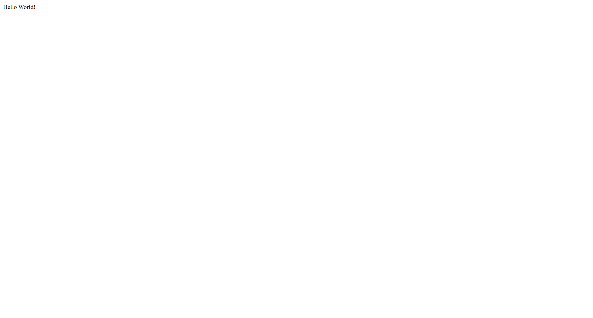

## Student

* Name: Павленко Іван
* Group: 232.1

## Практичне заняття №2 — NestJS + PostgreSQL + Redis

## Структура репозиторію

```
.
├── backend/           # NestJS source code
├── Dockerfile
├── docker-compose.yml
├── .env
└── README.md
```

## Запуск проекту

```bash
docker compose up --build
```

## Перевірка сервісів

```text
NAME                IMAGE                    STATUS
docker_practice-app-1        node:20-alpine         running
docker_practice-postgres-1   postgres:16-alpine     running (healthy)
docker_practice-redis-1      redis:7-alpine         running (healthy)
```

## Перевірка PostgreSQL

```text
                                         List of databases
   Name    |  Owner   | Encoding | Collate |  Ctype
-----------+----------+----------+---------+---------
 nestdb    | nestuser | UTF8     | C.UTF-8 | C.UTF-8
 postgres  | postgres | UTF8     | C.UTF-8 | C.UTF-8
 template0 | postgres | UTF8     | C.UTF-8 | C.UTF-8
 template1 | postgres | UTF8     | C.UTF-8 | C.UTF-8
```

## Перевірка Redis

```text
PONG
```

## Перевірка застосунку

```text
{"message":"Hello World!"}
```


## Логи NestJS (фрагмент)

```text
[Nest] 1  - Starting Nest application...
[Nest] 1  - InstanceLoader AppModule dependencies initialized
[Nest] 1  - InstanceLoader TypeOrmModule dependencies initialized
[Nest] 1  - Nest application successfully started
```
NestJS app with PostgreSQL and Redis
